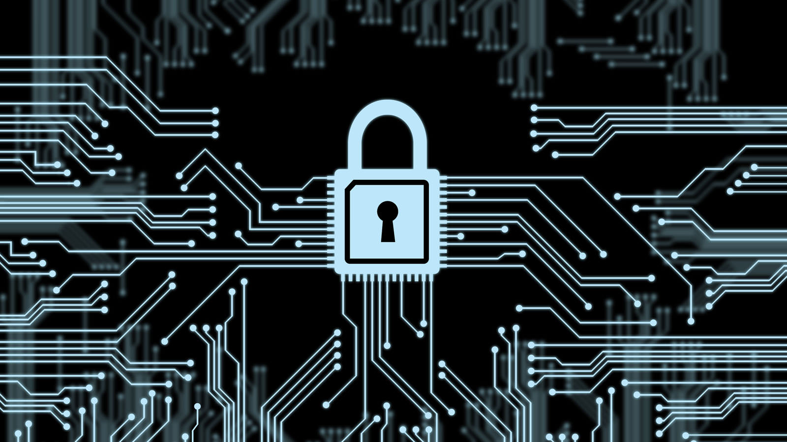

### Connection is secure?..

Do you trust your information is secure when you access a website with a valid Secure Sockets Layer/Transport Layer Security (SSL/TLS) certificate?  Since January 2018, Google Chrome has placed a “Connection Is Secure” logo depicting a padlock in the address bar for sites utilizing such technology.  We trust that the information being exchanged online is secure because of this feature; however, our information may not be as secure as we think due to careless implementation by the issuing authorities (Kuszmaul, 2019).  Manufacturers and certificate authorities have been utilizing the same random prime number generators for RSA (Rivest-Shamir-Adleman) encryption for decades allowing hackers to generate a list of most frequently used prime numbers (Lenstra, Hughes, Augier, Bos, Kleinjung & Wachter, 2012).  To measure the gravity of this security exploitation we need to examine the security flaw itself, the complexity of reproducing the exploitation, and the global impact to governments, industries, and individuals.  RSA based SSL/TLS certificates should not be trusted as secure for connections.

### What is RSA anyway

RSA ciphers are widely used throughout the world for encrypting Hyper Text Transfer Protocol Secure (HTTPS), Secure Shell (SSH) connections, and developer-based software updates for applications (Scharfglass, Weng, White & Lupo, 2013).  RSA encryption was the first publicly available algorithm of its kind when published in 1978 by computer scientists and mathematician Ron Rivest, Adi Shamir, and Leonard Adleman (Rouse, 2018).  The system works by multiplying two very large, randomly generated, prime numbers which we will assign to variables P and Q together to create a public key which we will assign to the variable N such that N = PQ (Rouse, 2018).  Next we create a private key for the decryption algorithm using the phi of N which is simply the least common multiple of P minus one and Q minus one such that D = (P - 1)(Q - 1); moreover, this is a specific property of both P and Q values being prime numbers (Rouse, 2018).  Combining everything, we get the cipher (MD)E  M (mod N) where M is our message, D is our private key, and E is public constant used to ensure (MD) is an integer(Rouse, 2018).  This encryption relies on the complexity of factoring N into prime numbers to solve for the private key if D is unknown, and it’s been extremely effective since 1978 (Rouse, 2018).

### So, size does matter

The recommended size of RSA encryption is greater than 2048-bit encryption which means it utilizes a public key, N, value greater than 2^2048 bits or 617 decimal digits long (Rouse, 2018).  This size encryption would normally take lifetimes for super computers to perform prime factorization to find the correct P and Q values, but a group of researchers decided to test all aspects of RSA encryption starting with how P and Q values are selected (Kuszmaul, 2019).  They collected over 4.7 million distinct RSA moduli and used recursion to find the P and Q values, searching for information that could lead to vulnerabilities (Lenstra, 2012).  They discovered that 12,720 moduli had a single prime factor in common, 71,052 (1.1%) moduli occurs more than once with some of them thousands of times, and 0.27 million (4%) have a completely shared modulus (Lenstra, 2012).  Using this information, we can perform factorization using these frequently selected prime numbers and quickly find results (Lenstra, 2012).  This evaluation has lead the researchers to find RSA encryption to be 99.8% secure (Lenstra, 2012).  However, the real security flaw remains with the researchers themselves (Kuszmaul, 2019).  They were able to find the prime number factorization for 6.2 million keys in just under 8 hours (Kuszmaul, 2019).  The team was able to perform these decryptions by transforming the problem from factorization to finding shared greatest common denominators (GCD) for multiple public keys, then testing to see if the value was prime (Cloostermans, 2012).  This allowed the researchers to find repeated prime factors using a new method in near linear space time complexity (Cloostermans, 2012).

### Can anyone do this exploit?

Reproducing the exploitation on your own is somewhat difficult due to having to write advanced mathematical algorithms, performing mathematics with integers larger than the number of bits a processor is capable of handling (BigInt), and having access to millions of public keys (Durumeric, Halderman, Heninger & Wustrow 2013).  I say somewhat difficult because if you were starting from scratch, handling BigInt values would be a difficult task alone; moreover, having to store integers as strings, convert the string value to integers in chunks, and performing binary (Bitwise) arithmetic using a more difficult programming language like C or C++ (Durumeric, 2013).  Additionally, accessing millions of public keys was time intensive and not easy to accomplish without performing illegal acts (Lenstra, 2012).  Unfortunately, the required calculations are part of downloadable libraries such as CUDA or GIMP, BigInt integration is part of the GIMP library for complex languages and is built in to Python and Java, and the Net Scan Tools library allows for easy retrieval of any SSL/TLS Certificate by scanning a range or list of servers; however, TLS1.3 is not currently supported by Net Scan Tools (Kuszmaul, 2019). Reproducing this exploit has become extremely simple because these toolsets and libraries are readily available and free for public use.

### What is the impact of this exploit in the wrong hands

Nation States and large corporations rely heavily on RSA encryption because of its wide availability and proven reliability (Rouse, 2018).  Technology companies like Google, Apple, and Facebook all utilize RSA encryption for communicating with their remote applications and users (Rouse, 2018).  Non technology companies such as Saudi Aramco which is the largest petroleum producer for the United States, Duke Energy which is the largest energy company in the United States, or Bank of America which has over 2.2 trillion dollars, also use RSA encryption for secure connections to servers which could devastate or even destroy the United States (Rouse, 2018).  While the world has not ended, our identities are not stolen, and we still have money in our bank account, we have to ask ourselves how much longer we can use a rudimentary encryption system that is on the verge of extinction.  Each day we use RSA encryption we invite dangerous people into dangerous situations without a second of thought.

### Is good enough ever realy good enough?

Supporters of RSA encryption sees the researchers claims of 99.8% secure and say that is a good enough security system (Lenstra, 2012).  After all, think about the things you do on a daily basis that have a less likely percent chance of being successful.  You don’t prevent yourself from doing those things because you may have failure, unless there is extreme consequence.  RSA encryption supporters defend that a physical danger does not exist on the internet, that you have a better chance winning the lottery than being the target of a hacker group, or that 99.8% secure is good enough.  In actuality, United States military uses RSA encryption to communicate personnel movements and deployments which if known by the opposition could lead to deaths of Soldiers.  While you may not be the target of an elite hacker group, your bank or business is more likely a target which would have equally bad implications if a successful hack took place.  And as for the 99.8% secure, those numbers were a maximum security and did not include the method used by the researchers to decrypt hundreds of thousands of secure connections.  It’s obvious that a new cipher is needed which can withstand the technology of today and the generations to come.

### How do we move forward with RSA?

RSA encryption for SSL/TLS has become a vulnerable technology that should not be trusted as a secure connection.  In the meantime, RSA prime number generators should be modified to increase the entropy and should not be shared, or mass produced.  While 2048-bit encryption is the recommended standard, higher encryption should be considered for vital Nation State infrastructure.  Pressure should be applied to businesses in order to increase security and privacy protection, and everyone should be educated on the importance and vulnerabilities of encryption. A Navy Commander once told me, “If God wanted to destroy everything, he would crack RSA.”

#### Work Cited

Cloostermans, B. (2012, August 22) Quasi-linear GCD Computation and Factoring RSA 
     Moduli, Retrieved February 26, 2019 from [https://pure.tue.nl/ws/files/67735608/741686-1.pdf](https://pure.tue.nl/ws/files/67735608/741686-1.pdf)
     
Durumeric, Z., Halderman, J., Heninger, N. & Wustrow, E.(2013) Mining Your Ps and Qs: 
     Detection of Widespread Weak Keys in Network Devices, Retrieved Februrary 26, 2019 from 
     [https://www.usenix.org/system/files/conference/usenixsecurity12/sec12-final228.pdf](https://www.usenix.org/system/files/conference/usenixsecurity12/sec12-final228.pdf)

Kuszmaul, W. (2019, January 15) The (Almost) Secret Algorithm Researchers Used to Break
     Thousands of RSA Keys, Retrieved February 26, 2019 from 
     [https://algorithmsoup.wordpress.com/2019/01/15/breaking-an-unbreakable-code-part-1-the-hack/](https://algorithmsoup.wordpress.com/2019/01/15/breaking-an-unbreakable-code-part-1-the-hack/)
     
Lenstra, A., Hughes, J., Augier, M., Bos, J., Kleinjung, T. & Wachter, C. (2012) Ron was 
     wrong, Whit is right, Retrieved February 26, 2019 from [https://eprint.iacr.org/2012/064.pdf](https://eprint.iacr.org/2012/064.pdf)

Rouse, M. (2018, November) RSA Algorithm (Rivest-Shamir-Adleman), Retrieved February 26, 
     2019 from [https://searchsecurity.techtarget.com/definition/RSA](https://searchsecurity.techtarget.com/definition/RSA)     

Scharfglass, K., Weng, D. & White, J. & Lupo, C. (2013) Breaking Weak 1024-bit RSA keys 
     with CUDA, Retrieved February 26, 2019 from [https://digitalcommons.calpoly.edu/cgi/viewcontent.cgi?referer=https://scholar.google.com/&httpsredir=1&article=1241&context=csse_fac](https://digitalcommons.calpoly.edu/cgi/viewcontent.cgi?referer=https://scholar.google.com/&httpsredir=1&article=1241&context=csse_fac)
