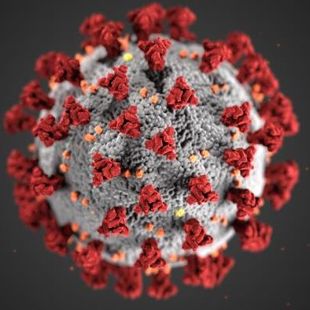

## Looking inwards

As I sit atop of a barstool for a chair at my makeshift desk in my living room, my two-year-old son hugs my leg and begs me to play with him.  I use my left hand to reach down and touch his hair as I apologize and tell him, “I can’t play right now, I’m working” as if he understands the gravity of deadlines.  Normally, my children would be at private school, my wife would be teaching university, and I would be working at Hawaii Space Flight Laboratory as an Avionics Engineer.  But we are on day 19 of quarantine as the government has issued stay at home orders for all residents and my children are going insane from being inside.  To make matters more complicated, my wife’s parents were visiting from Long Island, NY for my son’s birthday when the outbreak happened.  Now, the six of us are living in a 1,300sf high-rise condo in downtown Honolulu, HI.  The most interesting aspect of this adventure is that my wife’s parents are divorced.

## Sorry, daddy can't play right now

Being inside at my computer for remote classes and working from home between the hours of 8 am and 9 pm is having an impact on me physically and mentally.  Furthermore, I can see a mental impact on my children.  They don’t understand why I can’t play with them and I feel like they are getting the impression that I don’t care about them.  Being away from them and doing work is fine because when I do come home, I play with them, get them ready for bed, and usually stay up into the twilight to complete my homework after the kids are asleep.  It’s different because my children see me know during the day, try to engage with me, and I have to tell them no.  I can’t help but feel that my children view me as not liking them or prioritizing work and school over them.  It may sound silly, but I think my time in quarantine is damaging my relationship with my children.

## Non-traditional study

Being a non-traditional student has helped me through my courses so far.  I have experience working in my field of study and prior education that allows me to comprehend material more rapidly.  Furthermore, my fourteen years as a submariner in the Navy has prepared me for the mental stress of being indoors all the time.  But being a veteran and relying on my VA Post 911 GI Bill has also added a layer of stress to my family financially.  I have been planning on attending summer courses to keep receiving money for housing and because the University of Hawaii will be maintaining all classes online throughout the summer, I have to plan for my monthly income to be reduced by $2,200.

## Graduate school?

Looking forward to graduate school, I took my GRE on February 4th and am taking my final required class to apply for the “four-plus-one” master’s program for ICS.  The class has a requirement of passing with a “B” or higher which I am currently meeting.  With the University considering a pass or fail grading scheme for this semester, I have questions on how that will affect my application for the master’s program.  While I haven’t lost too much sleep over this, it does add a level of stress during this period of unknown and has increased the amount of time I have to spend talking with my academic advisor.

Overall, I am very thankful that my health and my family’s health has not been affected during this pandemic.  Watching the numbers on the mainland rise uncontrollably is terrifying; moreover, hospitals and the health care system not having enough supplies to combat this issue is even more terrifying.  This truly is something the world is not prepared for but hopefully we are able to learn, improve, and be ready for the next pandemic.
