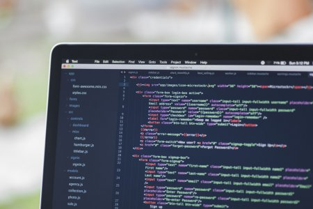

### JavaScript feels like a Frankenstein of Python and C

The syntax for JavaScript is largely taken from C with few differences which include objects and the ‘with’ requirement.  JavaScript is also a dynamically and weakly typed scripting language that offers cross-platform support, similar to Python.  In fact - for the name being “Java” Script - it doesn’t feel too much like Java.  Java is statically typed, offers effective object encapsulation, and uses class-based object types.  There is a reason for these differences though, and it’s simple.  Java was written by Sun Microsystems and JavaScript was written by Netscape; moreover, JavaScript was written by Brendan Eich in just 10 days.

### JavaScript was not written to be a general purpose programming language

JavaScript was built deliberately to provide web developers a way to bring object oriented programming to users over the internet through a web browser during the hustle and bustle of the dotcom boom.  Netscape was competing with Sun Microsystems, who offered Java for web applications, and Microsoft, who offered visual basic .NET for web applications, to provide a language that was lightweight, flexible, and most importantly “looked like Java”.  JavaScript was to be marketed as a spin-off of Java to attract use.

### Imperfections quickly became essential features

Brendan Eich understood that neglecting sleep and working for 10 days straight would have an impact on how well JavaScript was written.  He tried to foresee items that would normally cause issues in a language and made those specific areas “loose” so that the language would just “work”.  Eich understood his target audience, which was common web developers, and knew what their needs were for the web.  These imperfections have caused some web developers to reserve most functions and objects to operate in “strict mode” to ensure the web application responds as expected and reliably.  Eich, has tried to write what he calls “JavaScript 2.0”, which was formally known as ECMAScript Version 4.0 (ES4), just for it to be widely refused by programmers and considered a complete failure.

### Time affects experience and expectations

Since the beginning of JavaScript, there have been minor changes - more so tweeks - that have been widely accepted by the community as great improvements.  These releases have made significant impact, but it’s a slow process.  The most recent release, ES6, included some much needed improvement that increased how similar JavaScript looks and feels like Python.  The first being default values for parameters in the function definition.  
```javascript
let link = function(url = 'https://craigopie.github.io') {
  ...
}
```
Second, template literals allow programmers to incorporate variables into strings without having to concatenate the strings.  This simplifies ease of reading the code and actually speeds up the browser compilation time.   
```javascript
const name = `Your name is ${first} ${last}.`
let url = `https://craigopie.github.io/${id}`
```
Finally, employing multiline strings have never been easier by utilizing back-ticks to write block strings, similar to Python’s triple quotes.
```javascript
let roadPoem = `American hypocrisy 
                oh, let me count the ways
                They came here seekin' freedom
                Then they end up ownin' slaves`
```

### 10 days of work deserves 10 days of trial 

Ultimately, if you have never tried to use JavaScript or have and just didn’t like the experience, ES6 has brought great improvements and flexibility to the language.  My first experience with writing in JavaScript was in 2005 and was not impressed.  I thought the language lacked structure and was difficult to read.  I gave the language about 10 hours of thought before discounting its brilliance.  Now, in 2020, I’m revisiting JavaScript and after 10 days it has easily risen to be one of my top three favorite programming languages.  Understanding where JavaScript comes from and where it is going is important to truly appreciate the true elegance and versatility of the language.  Can you give JavaScript 10 days of trial?

#### Work Cited

Cassel, D. (2018, August 27). Brendan Eich on Creating JavaScript in 10 Days, and What He'd Do Differently Today. Retrieved January 13, 2020, from [https://thenewstack.io/brendan-eich-on-creating-javascript-in-10-days-and-what-hed-do-differently-today/](https://thenewstack.io/brendan-eich-on-creating-javascript-in-10-days-and-what-hed-do-differently-today/)

J. Cole (2017, January 16). High for Hours. Retrieved January 17, 2020, from [https://soundcloud.com/j-cole](https://soundcloud.com/j-cole)

Mardan, A. (2015, November 10). Top 10 ES6 Features Every Busy JavaScript Developer Must Know. Retrieved January 13, 2020, from [https://webapplog.com/es6/](https://webapplog.com/es6/)
