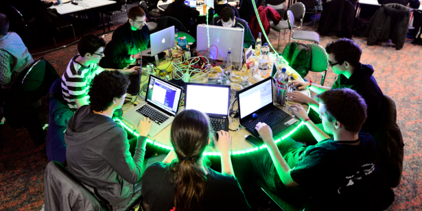

## Not all software engineers are created equal

I firmly believe that a software engineer is only as good as the time and effort they take to learn more about development, and practicing pragmatic applications of their knowledge.  The process of becoming a great software engineer requires certain skills and experiences that I hope to develop as an ICS major progressing towards a doctorate in computer science.  Skills that directly improve efficiency of speed and memory during code execution, experience working collaboratively to identify and correct vulnerable code, and developing the ability to balance learning and self development with work related deadlines. 

## Work smarter, not harder

Computing technology has changed drastically over the past twenty years.  Hardware in the late 1990’s provided faster computers by increasing the clock frequency which equated to more calculations per second.  Eventually, Intel reached a design maximum near 2004 with the Pentium 4 processor which was largely due to thermal dissipation restrictions and logic circuit setup and hold times.  Since then, circuit makers such as Intel, AMD, and Micron have focused on increasing chip density to perform more calculations which has led to the production of processors that house multiple cores.  Understanding how these processor cores are utilized and how memory is managed between them is vital to solving every software development company's primary challenge; moreover, providing the user with a real-time application that performs advanced functions without having to wait.  

One of the methods to accomplish this is to identify how the code being written performs using ‘time and space complexity’ metrics.  While analyzing algorithms, the metric most often considered is O-notation (pronounced ‘big-oh’ notation) because it represents the worst case execution time while describing the degree of complexity.  For instance, if a person has three ‘for’ loops and each has a nested ‘for’ loop with an additional two ‘for’ loops not nested it would be mathematically identified by 3N2 +2N.  For O notation this would be what is most limiting which would be expressed as O(N2) time complexity since all lines of code being executed once would be O(N).  Having an in-depth understanding of how your program operates with regard to time and memory required has a large impact on how well your code will be written.  

Consequently, the order of operations in which information is utilized also has a marked impact on execution time.  Recalling information or instructions that were recently used typically results in faster execution because the information still resides in the microprocessor’s cache.  Each time the microprocessor has to send out a request for information to the Direct Memory Access Controller (DMAC), or Northbridge Chipset it was to wait many cycles for information to be retrieved - ultimately, slowing down the execution time dramatically.  Knowing what information is being stored in cache and recalling that information before going to the DMAC separates advanced programmers from average programmers and will result in a product to be proud of.

## Community wide collaboration has many benefits for a developer

Each community project has a variety of programmers with different skills, education, and experience; furthermore, programmers from around the world with different language preferences often work on the same project bringing vast amounts of diversity to the way the code is written.  Being able to read another programmers code and efficiently working through to a resolution improves how future code will be written by the entire community.  Alternatively, if a software engineer makes a mistake in their code, someone else in the community will provide feedback or provide a cleaner and sometimes more secure approach to solve the problem.  This process of constructive criticism from a stranger’s viewpoint is often very effective in the development of highly visible projects.  Receiving praise is often times short-lived or impossible to achieve but stands as the ultimate proof of competence over a subject.

## Great developers are life-long-learners

The problem with being a software developer is that someone is always developing the next new ‘thing’.  As a result, every good programmer is constantly living their life playing catch up to how the world around them is changing.  Taking a few months off or focusing on work related deadlines without personal study often leads to missing out on new clients or getting passed over for promotion or a raise.  The challenge is that each programmer must become proactive with learning, identify and study trends, and research future product releases so that they know how tomorrows update is going to improve or break their code today.

## Skill up or fall down

Enhancing those skills and gaining collaborative experience is going to improve my ability to excel in areas I am most interested: cryptography, compression, embedded system development, artificial intelligence, and scientific applications.  This semester I hope to develop skills that directly improve efficiency of speed and memory in my code execution; accumulate experience with working collaboratively on code and identifying and repairing vulnerable code - this may be through my ICS courses but ultimately my proof of concept will be working on a community wide open source project; and to hone my skills of balancing learning and self development with work related project deadlines.  This will ensure I am able to continue on my path of a life-long-learner while maintaining an industry wide competitive edge.
