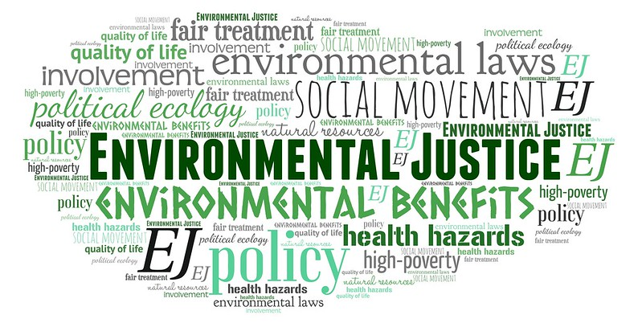

### The Context

“The environmental justice movement addresses a statistical fact: People who live, work, and play in America’s most polluted environments are commonly people of color and the poor.”   To better understand environmental justice, we must explore the events that helped launch the movement in 1982.  North Carolina planned to relocate contaminated soil from alongside two hundred ten miles of the state’s roadways to a landfill in Warren County – which concentrates the contaminates in a single location.  Additionally, Warren County was one of the very few counties in North Carolina where the majority of the population was black.  Reverend Joseph Lowery led five hundred protesters marching to the proposed toxic waste dump where he and U.S. Congressman Walter Fauntroy were arrested, along with about one hundred twenty other citizens who were blocking the trucks from entering the landfill.  Ultimately, North Carolina deposited the toxic soil in Warren County – “but the controversy crystallized the idea that the nation’s environmental problems disproportionately burden its low-income people of color.”  

Congressman Fauntroy demanded the General Accounting Office investigate issues of environmental justice with the objective to determine the correlation between the location of hazardous waste landfills and the racial and economic status of surrounding communities.  In 1983, it was confirmed using 1980 census data:

> There are four offsite hazardous waste landfills in Regions IV’s eight States [consisting of Alabama, Florida, Georgia, Kentucky, Mississippi, North Carolina, South Carolina, and Tennessee].  Blacks make up the majority of the population in three of the four communities where the landfills are located.  At least 26 percent of the population in all four communities have income below the poverty level and most of this population is Black. 

Four years later, Benjamin Chavis Jr., PhD coauthored Toxic Wastes and Race in the United States: A National Report on the Racial and Socio-Economic Characteristics of Communities with Hazardous Waste Sites with the intent to better enable the victims of environmental racism to become more aware of the problem and to participate in the formulation of viable strategies to become proactive in the interests of “millions of people who live in potentially health-threatening situations.”   This research revealed that three out of five Latino and Black Americans lived near a toxic waste site in the United States.

In the early 1990’s, social scientist, civil rights activists, journalists, and government agencies began bridging environmentalism and civil rights in a movement called environmental justice.  “Several environmental justice leaders signed a widely publicized letter to the ‘Big 10’ environmental groups, accusing them of racial bias in policy development, hiring, and the makeup of their boards, and challenging them to address toxic contamination in the communities and workplaces of people of color and the poor.”  This letter triggered change as some mainstream environmental organizations developed remedies to address the issues identified within the letter.  Even President Bill Clinton contributed by labeling environmental justice “an important domestic priority” at an Earth Day speech in April 1993.

### The Problem

The road to environmental justice is not easy and isn’t happening voluntarily by politicians.  “A political movement must be built through the recognition that those exploited and dominated by globalizing capitalism share a common structural relation to capital.”   Despite the vast efforts of environmental justice leaders, such as Congressman Fauntroy and Benjamin Chavis Jr. PhD., America did not recognize this common structural relation leading up to the Environmental Justice Act of 1992.  The act was read twice each to the 102nd Congress and then referred to the Committee on Environmental and Public Works where the Act was reviewed by the eighteen-person board – all of which were white males with the exception of Jocelyn Burdick, a white female, from North Dakota.   It’s important to understand that thirteen of the eighteen members represented states that were of low Black and Latino population and were not identified as areas of concern in the National report published by Benjamin Chavis Jr., PhD.   The Environmental Justice Act of 1992 (which had the very strong support of forty-four cosponsors) was tabled with no available explanation of why the act was killed.  This past year, Cory Booker (African American Senator of the 116th Congress) reintroduced the legislation as the Environmental Justice Act of 2019, which was again read twice to the Senate and House before being referred to the Committee on Environmental and Public Works to die.   America is unable to be empathetic and defend communities impacted by environmental inequality because of white privilege and white fragility.

### The Evidence

Paul Mohai, a professor at the University of Michigan School for Environment and Sustainability, co-organized the 1990 Michigan Conference on Race and Incidence of Environmental Hazards.  “The researchers and scholars [he] invited were asked to write and submit an original paper for presentation and discussion.  [Those papers…were subsequently reviewed and published in 1992 by Westview Press under the title Race and the Incidence of Environmental Hazards: A Time for Discourse.”   This piece featured case studies conducted by Harvey White, Conner Bailey, and Charles Faupel which demonstrated that politics of affluent white suburbs were successful in displacing toxic waste dump sites into minority communities – dubbed NIMBY (Not In My Back Yard) politics.  One of the examples that support this case study is Baton Rouge, Louisiana where minority communities lack contacts, organization, and money to resist toxic waste dump sites.  As a result, “white communities house 1% of hazardous waste dumps, while smaller minority communities have 99% of the waste.”

Mohai later addressed the disproportionately burdened community of Flint Michigan, a location where poor people and people of color are concentrated, in his article “Environmental Justice and the Flint Water Crisis” published in 2017.   The poisoning of Flint’s water supply has been a focus of national and international attention as it has become a critical crossroad in our nation’s history.  In April 2013, a city’s Emergency Manager approved the switch of a pipeline, constructed by the Karegnondi Water Authority, which was responsible for bringing water from the Detroit water supply to Flint’s water supply as a cost cutting measure.  While the new pipeline was in production, the city transitioned to using the Flint River Water Treatment Plant to supply the city; however, the plant did not have the capacity to treat the water adequately and was never upgraded to do such.  For an unknown reason, the Michigan Department of Environmental Quality (MDEQ) did not require optimized corrosion control in the treatment of the water – in contradiction to long standing federal policy.  “It was the lack of optimized corrosion control that resulted in the corrosion of water service lines and interior lead-based plumbing (solder, fixtures, faucets) in Flint, which in turn resulted in the leaching of lead and other contaminants into residents’ water.”   In April 2014:

> Residents noticed the change in water quality almost immediately.  The water was discolored and had an odor and people began to complain about skin rashes and hair loss that they suspected were linked to the water.  Later, concerns about lead poisoning emerged.  Although not made public until January 2016, concerns about a Legionnaires’ disease outbreak linked to the water were discussed internally among several public agencies in 2014 and 2015.  The response by State officials was nevertheless to publicly dismiss these concerns and issue what turned out to be false assurances to the residents. 

A Michigan ACLU documentary Here’s to Flint shows a scene where a State official addresses a group of protestors at the State Capitol “with apparent mocking contempt as ‘YEEEOU PEOPLE’” while others dismissed residents and called them “liar” and “stupid”.  Meanwhile, state officials began installing water purifiers in all State office buildings and only providing bottled water to its employees and guests.  

Mohai and many other environmentalists identify this situation as a case of Environmental Injustice.  Flint is a “majority minority” city and the most recent U.S. Census data shows an African American percentage of 54.3%, which is significantly greater than the states African American percentage of just 14.1%.  “Residents are not given meaningful say in the decisions that affect their communities and quality of life.  Their concerns about pollution and the health impacts are minimized, discounted or dismissed, and residents are treated disrespectfully and shown they have little influence or clout.”   Furthermore, “given the magnitude of the disaster in Flint, the role that public officials’ decisions played that led to the poisoning of the city’s water, their slow pace at acknowledging and responding to the problem, and the fact that Flint is a city of almost 100,000 people indeed makes this the most egregious example of environmental injustice and racism in [his] three decades of studying [the] issue.”

Lee-Anne Walters, the Flint resident that was called a “liar” and “stupid” but State officials, has twin boys that don’t talk like other boys their age and can’t remember their colors or ABCs – despite knowing them before the water crisis began.   One child suffers from a growth deformity as he was just 39 pounds at six years old while both suffer from hand-eye coordination issues.  Flint pediatrician Mona Hanna-Attisha, PhD identified these symptoms as short-term and long-term lead exposure.  Lead exposure lowers IQ levels and create cognitive and behavioral issues for children.   “Lead is an irreversible neurotoxin.  There is no Cure.  There is no antidote.”  Hanna-Attisha further supported these claims, stating “it’s not just [Walters children].   Children all over the city have been exposed to lead” and are having similar issues.  Environmental injustice and pollution typically affect children the most, especially ages one to five, where development happens rapidly.

“Mott Haven in the South Bronx is a classic example where Black and Hispanic residents experience a particularly insidious ‘environmental inequality’.”   Mott Haven is a New York City neighborhood that is nicknamed “Asthma Alley” because it has the worst air pollution levels in the United States.  Some that are opposing Mott Haven as being an area of environmental injustice stand by the reason that New York City has overall elevated air toxicity levels due to congestion within the city.  However, in Mott Maven residents undergo “asthma hospitalizations at five times the [cumulative] national average and at rates [twenty-one] times higher than other New York City neighborhoods.”    Mott Haven residents inhale the emissions of hundreds of diesel-powered delivery trucks transiting to-and-from the nearby Fresh Direct warehouse, exhaust from nearby highways, the smell of toxins from the Wall Street Journal printing presses, and the fumes from a parcel depot and sewage works which are nearby.  “This all makes Mott Haven, where 97% of the population is Hispanic or Black, a classic example of a place caught in a particularly insidious ‘pollution inequity’.”   What makes the issue more sufferable is that the residents aren’t using the services that are providing the toxins, they can’t afford it.  While few nearby residents work in the factories and live on the money earned. We must ask the question, “why should any human ever be forced to make a choice between air and a low-wage job?” 

### The Legislation

Democratic Representative Alexandria Ocasio-Cortez of New York and Democratic Senator Cory Booker of New Jersey are the faces of today’s Environmental Justice movement.  Representative Ocasio-Cortez (Hispanic or Latino American member of the 116th Congress) for introducing the Green New Deal – a congressional resolution that lays out a plan for tackling climate change.   And Senator Booker (African American member of the 116th Congress) for introducing the Environmental Justice Act of 2019.   While Senator Booker’s legislation contains hard set metrics and deadlines that are binding for corporations and government organizations, Representative Ocasio-Cortez is proposing a resolution that is nonbinding in hopes that it is better received by right-wing conservatist. 

The Green New Deal contained variations of proposals from Green Party think tanks and New York Times columnist Thomas Friedman on plans to combat climate change.  Representative Ocasio-Cortez became involved after a youth activist group, called the Sunrise Movement, held a sit-in outside of Nancy Pelosi’s office to demand action on climate change.  Representative Ocasio-Cortez ultimately set the groundwork for what became the joint resolution which had key elements that supported an approach to be net-zero emissions by 2050, shift the country’s electricity production to renewable energy sources, overhaul the nation’s transportation system to use clean energy vehicles, and propose changes to the ways buildings are designed.  “The resolution itself also [steered] clear of endorsing or rejecting specific technologies or sources of energy…purposefully, to encourage broader support for the plan.”

Republican Officials contested the Green New Deal: “President Trump has claimed the Green New Deal will take away your ‘airplane rights’; Senator Tome Cotton, [Arkansas], told Hugh Hewitt, the conservative radio host, that the proposal would confiscate cars and require Americans to ‘ride around on high-speed light rail, supposedly powered by unicorn tears’; and Senator John Barrasso, [Wyoming] and chairman of the Committee on Environment and Public Works, warned that ice cream, cheeseburgers and milkshakes would be a thing of the past because under the Green New Deal, ‘livestock will be banned’.”   The resolution didn’t contain any of those things and, as stated before, was a nonbinding resolution, so even if Congress approved the Green New Deal, nothing in the proposal would have become law.  “Republicans [casted] the Green New Deal as a socialist takeover and [said] it is evidence that Democrats are far from the mainstream on energy issues.” 

Republican Senate Majority Leader Mitch McConnell rushed the Green New Deal to the Senate floor on March 25, 2019 indicating that Senate Republicans would kill the measure.  The resolution did not advance in the Senate and held a margin of 0-57, with forty-three Senate Democrats voting “present” in protest of the early vote called by Republicans.  Meanwhile, “progressive groups signaled ahead of the vote that they were giving Senators a pass on the Green New Deal vote and were supportive of Senators who planned to vote present in protest.”   Democratic Senators Joe Manchin, Kyrsten Sinema, Doug Jones, and Angus King (all are White Americans) voted with Republicans against the measure.

The Environmental Justice Act of 2019 reintroduced sweeping legislation to “require federal agencies to mitigate environmental injustices through agency action and strengthen the legal protections of those affected by environmental injustices” on July 23rd, 2019.   Senator Booker, a member of the Senate Environment and Public Works Committee, worked closely with dozens of grassroots organizations to craft the bill while visiting numerous sites subject to environmental injustice, including “Cancer Alley” which is an eighty-five mile stretch of land between Baton Rouge and New Orleans, Louisiana – home to more than one hundred fifty industrial plants and oil refineries.

Senator Booker also “co-founded the Senate’s first-ever Environmental Justice Caucus to call attention to the many environmental justice issues affecting our nation.”  Despite the evident march towards environmental justice and overwhelming recognition and admission, from Congress, that climate change is real and caused by humans, the Environmental Justice Act of 2019 was again referred to the Committee on Environment and Public Works after its initial reading where the committee has yet to review the legislation.   Skopos Labs, an organization consisting of artificial intelligence researchers, data engineers, attorneys, and financial professionals which is backed by the strategic investments group of global investment bank Thomson Reuters, predicts the bill only has a three percent chance of being enacted.

“Although no federal legislation has yet been enacted on environmental justice, in 1994 President Bill Clinton signed the Environmental Justice Executive Order 12898 calling on all the agencies of the federal government, not just the EPA, to consider environmental justice consequences in their rulemaking.”   This Executive Order is and will most likely remain the “high-water mark” in Federal policymaking for the foreseeable future, given the historic record of unsuccessful attempts to pass environmental justice legislation in Congress.

The current Senate Committee on Environment and Public Works consists of twenty-one members, eleven Republican members and ten Democrat members.  While the committee has become more diverse over the years, it still consists of just one African American Senator and one Asian/Pacific Islander American Senator with the remaining nineteen Senators being White Americans.   Furthermore, only four three of the White American Senators and Senator Booker represent states identified as being problematic for environmental injustice leaving 76% of the committee votes to be determined by White Americans that do not represent states that are experiencing severe cases of environmental inequity and benefit from white privilege.

### The Theory

White privilege is defined by the Oxford dictionary as: inherent advantages possessed by a white person on the basis of their race in a society characterized by racial inequality and injustice.  This unearned and mostly unacknowledged social advantage is often times misidentified by the very people benefiting from it.  Robin DiAngelo, PhD – Doctoral Degree in Multicultural Education from the University of Washington in Seattle, holds two Honorary Doctoral Degrees, with her area of research is in Whiteness Studies and Critical Discourse Analysis, tracing how whiteness is reproduced in everyday narratives, and also coined the term ‘White Fragility’ in an academic article which influenced international dialogue on race – has identified that white people demonstrate “disbelieving defensiveness … when their ideas about race and racism are challenged – and particularly when they feel implicated in white supremacy.”   She argues that our “largely segregated society is setup to insulate whites from racial discomfort, [and] so they fall to pieces at the first application of [racial] stress.  This leads them to respond with emotions such as anger, fear and guilt, and behaviors such as argumentation, silence, and withdrawal from the stress-inducing situation.”

In fact, DiAngelo PhD “[has] found that the only way to give feedback without triggering white fragility is not to give it at all.”  She further identifies that the social costs for a black person to point out discrimination when they see it is so high, that many black people don’t address the discrimination at all; moreover, “white people will forbear from correcting each other’s racial missteps, to preserve the peace – [which] makes genuine allyship elusive.  White fragility holds racism in place.”   As for anti-racism efforts:

> Even the racial beliefs and responses that feel authentic or well-intentioned have likely been programmed by white supremacy, to perpetuate white supremacy.  Whites profit off of an American political and economic system that showers advantages on racial “winners” and oppresses racial “losers.”  Yet, white people cling to the notion of racial innocence, a form of weaponized denial that positions black people as the “havers” of race and the guardians of racial knowledge.  Whiteness, on the other hand, scans as invisible, default, a form of racelessness.

As a sociologist trained in mapping group patterns, DiAngelo, PhD recounts ideologies such as individualism, or the “distinctly white-American dream that one writes one’s own destiny, and objectivity, the confidence that one can free oneself entirely from bias” is naïve and arrogant.   The same applies to thinking that someone can simply uproot and find a new location to live or profession to work when social objections are present in living conditions.

### The Conclusion

Overall, the 116th Congress consists of a record 56 African American Members (10.4% of the total membership), 51 Hispanic or Latino American Members (9.4% of the total membership - some which are also included in other minority demographics), a record 20 Asian/Pacific Islander American Members (3.8% of the total membership), and a record 4 Native American Members (0.7% of the total membership).  There is a staggering 408 White American Members (76.0% of the total membership) in the 116th Congress that control decisions made for minority communities.   Marian Miller keenly identified:

> When there is a separation of producer from consumer, employee from employer, and investor from investment, the decision-making process is freer to ignore the externalities that might otherwise be factored in.  This kind of decision-making process justifies the hazardous waste trade and the establishment of hazardous waste landfills and incinerators in poor communities.

Applying Miller’s and DiAngelo’s research and positions to the 116th Congress allows us to identify that Congress continuously tables and kills the Environmental Justice Act because the vast majority of the members of Congress do not experience or see the impact of race, class, and environmental inequality in the United States of America.  Furthermore, they are too frail to confront the issues.

Some claim that influence by “big oil” or “Corporate America” funding for political campaigns drives Congresses actions or - more accurately - inaction towards environmental injustice.  While this argument holds ground as evident by the Environment and Public Works Chairman, John Barrasso, receiving $1,141,204 from the oil and gas industry – his top contributor.   However, this claim is equally supportive towards white privilege as White American Congress Members are disproportionately receiving funding by corporations in opposition to the Environmental Justice Act.  Senator Booker and Senator Duckworth, the only two minorities on the Environmental and Public Works Committee did not receive any campaign funding from the oil and gas industry.    Awareness needs to be delivered to our representatives to protect our communities because “environmental inequality often goes hand in hand with other forms of exploitation and discrimination.”   They white fragility preventing important discussions of race, class, and environmental inequality in the Senate Committee on Environmental and Public Works is hardly invisible to people of color, many of whom, I suspect, could have written this paper in their sleep.

#### Work cited:
- “About Us.” https://www.skoposlabs.com Skopos Labs (2020)
- “All Information for H.R.2105 – Environmental Justice Act of 1992.” https://www.congress.gov/bill/103rd-congress/house-bill/2105/all-info. US Government (2020)
- “All Information for S.2236 – Environmental Justice Act of 2019.” https://www.congress.gov/bill/116th-congress/senate-bill/2236/all-info. US Government (2020)
- “Booker Reintroduces Sweeping Environmental Justice Bill.” https://www.booker.senate.gov/news/press/booker-reintroduces-sweeping-environmental-justice-bill#:~:text=The%20Environmental%20Justice%20Act%20of,in%20the%20House%20of%20Representatives. US Government (2019)
- “History and Recent Membership of the Committee on Environment and Public Works.” https://www.epw.senate.gov/public/index.cfm/committee-history. US Government (2020)
- “Senator John A Barrasso – Wyoming.” http://www.opensecrets.org/members-of-congress/summary/john-barrasso?cid=N00006236. Open Secrets (2020)
- “Senator Cory Booker – New Jersey.” https://www.opensecrets.org/members-of-congress/summary?cid=N00035267. Open Secrets (2020)
- “Senator Tammy Duckworth – Illinois.” https://www.opensecrets.org/members-of-congress/summary?cid=N00027860. Open Secrets (2020)
- Bryant, Bunyan and Paul Mohai (eds.) “Race and the Incidence of Environmental Hazards: A time for Discourse.” Westview Press (1992)
- Cabrera, Yvette. “Here are the Environmental Justice Stories to Watch in 2020.” Grist (2020)
- Carney, Jordain and Miranda Green. “Senate Blocks Green New Deal.” The Hill (2019)
- Chavis Jr., Benjamin. “Toxic Waste and Race in the United States: A National Report on the Racial and Socio-Economic Characteristics of Communities with Hazardous Waste Sites.” Commission for Racial Justice (1987)
- DiAngelo, Robin. “Critical Racial and Social Justice Education.” Robin DiAngelo (2020)
- Florio, James. “Siting of Hazardous Waste Landfills and Their Correlation with Racial and Economic Status of Surrounding Communities.” General Accounting Office (1983)
- Friedman, Lisa. “What is the Green New Deal?  A Climate Proposal, Explained.” The New York Times (2019)
- Garg, Renu, Adam Karpati, et. “Asthma Facts, Second Edition” New York City Department of Health and Mental Hygiene (2003)
- Gulledge, Jacqueline. “Flint Water Crisis Leaves Long-Term Impact on Children’s Health.” CNN (2017)
- Keeva, Steven. "A Breath of Justice - Along with Equal Employment Opportunity and Voting, Living Free from Pollution Is Emerging as a New Civil Right," ABA Journal 80, no. 2 (1994): 88-92
- Kilani, Hazar. “’Asthma Alley’: Why Minorities Bear Burden of Pollution Inequity Caused by White People.” The Guardian (2019)
- Lapook, Jonathan. “Doctors Explain the Long-Term Health Effects of Flint Water Crisis.” CBS News (2016)
- Manning, Jennifer. “Membership of the 116th Congress: A Profile.” Congressional Research Service (2020)
- Miller, Marian. “The Third World in Global Environmental Politics.” Buckingham: Open University Press (1995)
- Mohai, Paul. “Environmental Justice and the Flint Water Crisis.” Michigan Sociological Review, Vol. 32 (2018)
- Newell, Peter. “Race, Class and the Global Politics of Environmental Inequality.” Global Environmental Politics 5:3 (2005)
- Palmer, Brian. "The History of Environmental Justice in Five Minutes: How Communities of Color Facing the Brunt of Pollution Launched the Movement for a Healthy Place to Live, Work, and Play – And Where It’s Headed." NRDC Article (2016)
- Rupert, Mark, and Hazel Smith, eds. “Historical Materialism and Globalisation: Essays on Continuity and Change.” Routledge (2016)
- Strauss, Valerie. “How the Flint Water Crisis set Back Thousands of Students.” The Washington Post (2019)
- Waldman, Katy. “A Sociologist Examines the ‘White Fragility’ that Prevents White Americans from Confronting Racism.” The New Yorker (2018)
