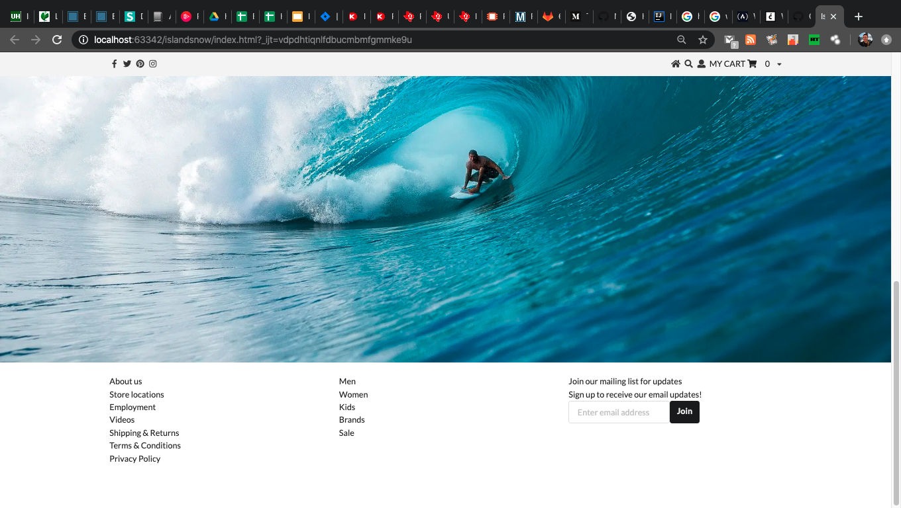

### UI Frameworks are not simple

Semantic UI is a UI Framework that is extremely complex but doesn’t really do anything the average programmer can’t do without time and effort.  This begs the question of, “what does one get in return for the investment of time and frustration? Why not just use raw HTML and CSS?”  The answer has everything to do with teamwork.



Having a UI Framework allows multiple collaborators to work on the same web site with a known standard of formatting and styles.  This allows content creators to use the standard library to create their content without having to develop their own stylesheets.  Having a team that all use the same UI Framework saves time during development, proofreading other team members code, and troubleshooting design errors.

### Save time and money

Semantic UI and similar UI Frameworks are sometimes difficult and time intensive to learn, but most UI Frameworks offer fantastic training platforms that are rich in content and allow rapid adaptation to their content.  Additionally, there are libraries and in-depth documentation with example code available at no additional cost.  Within minutes of starting with Semantic UI training, the user learns to implement intensive style platforms and techniques that would take hours to develop on their own.  For example, a pointing dropdown list can be implemented as easy as:
```html
<div class=”ui menu”>
  <a class=”item”>
    Home
  </a>
  <div class=”ui pointing dropdown link item”>
    <span class=”text”>Shopping</span>
    <i class=”dropdown icon”></i>
    <div class=”menu”>
      <div class=”header”>Categories</div>
      <div class=”item”>
        <i class=”dropdown icon”></i>
        <span class=”text”>Clothing</span>
      </div>
   </div>
</div>
```

### Start using Semantic UI today!

Overall, Semantic UI is an easy to learn, fully functional, time saving, cost effective implementation of standardized styling for any small to large scale web site.  I highly encourage all freelance web developers to check out what Semantic UI has to offer, and challenge them to streamline their own development time.
